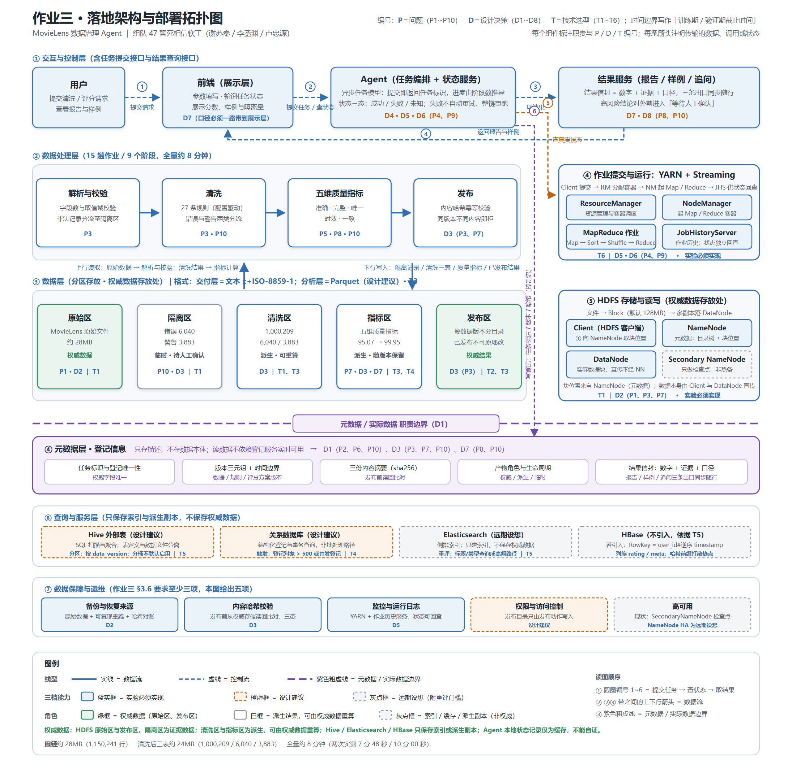

# 作业三：大数据存储和处理的技术选型路线图

### MovieLens 数据治理 Agent ｜ 组队 47 誓死相信软工（谢苏秦 / 李丞渊 / 卢忠源）

---

## 1 引言与承接

### 1.1 作业定位与边界

本学期课程从 Google 三驾马车的设计思想延伸至 Hadoop 生态的具体实现，并讨论关系数据库、NoSQL 与全文检索的访问模式差异，行存、列存与倒排索引，HDFS 的节点角色和文件读写流程，MapReduce 处理链路，HBase 的数据模型与 Region，以及 Hive 的数据仓库抽象。本作业在这些内容的基础上，把作业二已经形成的问题与设计决策落实为**具体技术选型**：比较候选技术，并将设计决策落实为系统、组件、数据格式、表结构和部署方式。

### 1.2 与作业二的承接

作业二已完成**问题发现与设计决策**，输出问题编号 **P1~P10** 与设计决策编号 **D1~D8**，两套编号已冻结。本作业接受这些结论作为输入，聚焦具体技术选型，**不再发现或论证作业二已经分析的问题，也不重新作出原则性设计决策**。

两份作业的分工边界如下：

| 作业二已经负责 | 本作业负责 |
| --- | --- |
| 给出问题、证据、触发条件、影响和优先级 | 接受问题结论，并比较能够处理相关问题的技术 |
| 给出设计决策、所需能力、约束和验收条件 | 为设计决策选择具体技术 |
| 确定系统所需的存储、计算、查询和恢复能力 | 选择 HDFS、对象存储、MapReduce、HBase、Hive 等技术 |
| 绘制技术中立的逻辑架构 | 绘制组件架构和部署拓扑 |
| 说明哪些问题现在处理、以后处理或暂不处理 | 说明技术的引入、替换、迁移或下线时机 |
| 保留风险和触发重评条件 | 说明技术限制、运维成本和回退方法 |

### 1.3 编号约定（P / D / T / C 四套）

| 前缀 | 含义 | 出处 |
|---|---|---|
| **P1~P10** | 问题编号 | 作业二最终稿，已冻结 |
| **D1~D8** | 设计决策编号 | 作业二最终稿，已冻结 |
| **T1~T6** | 技术选型编号 | 本作业新增（§3.5） |
| **C1~C6** | 比较框架编号（本文自加，非课程要求编号） | §3.1 追踪框架 |

## 2 总体要求与推理链

### 2.1 本作业回答的问题

> 针对作业二中的问题 P1~P10 和设计决策 D1~D8，哪些具体技术能够满足所需能力与约束？为何从 HDFS、HBase、Hive、MySQL、Elasticsearch、对象存储或其他候选方案中作出相应选择？所选技术应如何组合、配置、部署和迭代？

### 2.2 推理链

> 问题 P 与设计决策 D → 所需能力与约束 → 候选技术比较 → 技术选型 T → 落地架构 → 分阶段演进

本文各节与这条链一一对应：§3.1 把 P / D 转成能力与约束；§3.2 按数据对象落到访问模式；§3.3 分析课堂技术各自适合什么；§3.4 补一条工业界前沿路线的调研；§3.5 收敛成 T1~T6；§3.6 画成落地架构图；§3.7 给出引入 / 替换 / 迁移 / 下线时机。

---

## 3 详细要求

本节不提前给出最终技术选型，而是严格承接作业二已经形成的问题（P）与设计决策（D），先把它们转化为后续技术比较所必须满足的能力与约束，再结合数据对象和访问模式分析课堂技术各自适合解决什么问题。最终选择在本文 3.5 节统一收敛。

### 3.1 输入与追踪关系

作业三的技术选型不再重新论证作业二已经确定的问题，而是把作业二形成的问题 P1–P10 与设计决策 D1–D8 作为输入，将已经确定的技术中立能力进一步落实为后续候选技术比较所使用的评价边界。也就是说，本节不以“哪个产品更先进”作为起点，而以“系统究竟需要什么能力、又受到什么约束”作为起点，再观察不同技术能否满足这些要求。作业二已经明确，P1–P3 主要属于存储问题，分别涉及正式数据没有可靠恢复来源、登记信息随任务和版本增长而集中、正式结果存在覆盖和版本混用风险；P4–P5 属于计算问题，集中体现为失败判定不可靠、缺少部分恢复，以及随着数据规模和聚合规模增长后单点内存和数据移动可能成为瓶颈；P6–P7 属于数据组织问题，核心是访问模式逐渐从全量扫描扩展到按业务键查询，同时多版本结果和中间产物缺少生命周期规则；P8–P10 属于系统可信性问题，要求 Agent 的数字与解释可信、任务展示状态与真实执行状态一致，并确保结果口径和证据链能够完整回溯。作业二进一步将这些问题收敛为 D1–D8 八项设计决策，包括登记信息与数据读写分离、关键数据具备恢复来源、正式结果不可变与发布幂等、异步任务状态模型、以独立执行来源判定任务状态、失败恢复以可靠判定为前提并以安全重跑为主、结果与证据及运行口径绑定，以及对高风险结论实施分级人工确认。

因此，后续技术比较首先需要回答的是：技术能否支撑“权威数据”和“登记信息”的分离，能否让正式数据或证据在节点失效、误删或服务重启后仍有可靠恢复路径，能否支持不可覆盖的版本演进与内容校验，能否承载任务状态、版本关系和结果证据信息的结构化查询，能否适应当前以全量扫描和批量聚合为主、未来逐步出现点查、范围查、聚合、图查询和全文检索并存的访问模式，以及能否在这些能力之外保持与当前课程实验环境相匹配的复杂度和运维负担。这里尤其需要注意，作业二已经判断当前原始数据体量并不大，当前实测主要数据约为 28MB 级，而系统真正值得关注的增长来自作业链长度、任务状态对象数量、版本对象数量和后续模型、画像、图谱等派生产物。因此，技术比较不能简单以“数据越大越应该使用分布式技术”为逻辑，而应结合访问模式、对象数量、失败代价、一致性和生命周期综合判断。

基于上述输入，可以把作业二向作业三的追踪关系整理为以下比较框架。这里的“候选技术”表示后续需要比较的具体技术路线，并不等于本节已经决定采用。

| 追踪编号 | 来源 | 需要落实的能力与约束 | 候选技术方向 | 后续应重点比较的问题 |
|---|---|---|---|---|
| C1 | P1、P7 → D2；P3 → D3 | 权威数据与关键证据具有恢复来源；恢复后可以通过内容校验确认与正式版本一致；正式结果不可覆盖 | 本地文件、HDFS、对象存储等 | 故障恢复能力、数据副本与备份方式、恢复成本、与 Hadoop 作业的衔接、当前实验复杂度 |
| C2 | P6、P7 → D3 | 原始事实需要长期保真；清洗后的结构化数据需要支持后续分析；不同产物需要有版本和生命周期 | 文本、SequenceFile、Parquet、ORC 等 | 全量扫描效率、列裁剪能力、压缩、模式表达、更新与版本管理、与 Hive 的结合 |
| C3 | P2、P9、P10 → D1、D4、D5、D7 | 登记信息结构化、权威字段唯一；任务点查与范围查询；状态与版本关系可追踪；实际数据读取不依赖登记服务实时可用 | 本地文件、关系数据库、HBase 等 | 点查和范围查、随机更新、唯一性约束、事务与恢复、一致性、并发与维护成本 |
| C4 | P5、P6 → D6 | 批量全量扫描、连接、聚合能够稳定运行；数据规模增长后能够继续扩展；失败时重跑边界清晰 | MapReduce、Hive 等批处理访问与计算方式 | 数据划分、Shuffle、聚合、数据倾斜、作业粒度、失败重试与中间结果管理 |
| C5 | P6、P5 → B1、B2 | 未来按用户、电影、时间和实体进行选择性访问时不必始终全量扫描；需要明确业务键组织原则 | HBase、关系数据库及其他键值/宽列方案 | 点查、范围查、RowKey 设计、热点、版本读取、写放大和运维复杂度 |
| C6 | P6 → B1；SC2、SC5 | 当标题、类型等文本查询演变为真正的全文检索需求时，需要比普通字段匹配更适合的访问方式 | 关系数据库字段查询、Elasticsearch 等倒排索引方案 | 全文召回、模糊匹配、相关性排序、索引维护、数据同步和额外副本 |

> **关于编号**：C1~C6 是本文的比较框架编号，不是课程要求的编号。C5、C6 中的 B1/B2、SC2/SC5 是作业二内部的推演与机制编号，在本作业中统一归入 D1（登记与查询职责分层）约束的范围，其最终技术落点见 T5。另：「结果发布与提交方式」在 C1~C6 中没有独立行，本文将其并入 C1 的落地方式，由 T2 单独承接。

这里的追踪关系应当一直保持到后文：候选技术比较必须能够回到 P/D，最终技术选择也必须能够说明自己具体满足了哪一项能力、没有解决哪一项能力，以及在什么条件变化后需要重新选择。这样才能避免“技术名称很多，但没有和问题建立因果关系”的情况。

### 3.2 数据对象与访问需求

技术选型进一步必须落实到数据对象，因为同一个系统内不同数据承担的职责不同，其写入方式、读取方式、一致性要求和生命周期也不同。作业二已经将本系统当前的数据资产划分为原始三表、清洗后三表、隔离记录、质量指标与报告、任务状态与元数据、发布清单与哈希六类对象，并且已经明确它们在整个数据流中的角色。因此，后续选择技术时应首先回答“这份数据究竟是什么”，再回答“它应该存在哪里”。

#### 3.2.1 MovieLens 原始文件

MovieLens 原始 ratings、users、movies 文件属于外部给定的权威数据，是整个清洗和评分流程的事实起点。它们的写入模式主要是一次性导入，之后原则上只读；读取方式以全量扫描为主，因为数据治理任务需要对原始数据的完整内容进行解析、校验和清洗，而不是频繁随机修改其中某几行。它们的一致性要求也与普通业务数据不同：最重要的是内容保持原始状态，使任何清洗结果、质量指标甚至未来模型都能够在需要时从同一份输入重新计算。因此，它们的生命周期应当较长，不应因为中间任务完成而删除。作业二还明确指出，当前原始数据仅为约 28MB 级，当前真正需要提前设计的是“发生故障之后能否恢复，以及恢复结果能否被验证”，而不是立刻把存储体系扩展到最大规模。

这意味着原始文件的候选技术比较应围绕“原始事实保护”和“批处理输入能力”展开，而不是只比较单次读取速度。后续可以比较本地文件、HDFS 和对象存储等不同方案：本地文件最简单，但其故障隔离和分布式作业组织能力较弱；HDFS 将文件切分为 Block 并由 NameNode 和 DataNode 分工管理，天然衔接 Hadoop 作业；对象存储则以对象为基本持久化单位，更强调独立持久保存和存算分离。当前阶段应先把这些方案的适用边界写清楚，再结合工业界调研决定最终落点。

**对应来源**：P1（正式数据无恢复来源）、P7（产物生命周期）→ D2（关键数据具备恢复来源）→ 技术落点 **T1**（大表主存储）。

#### 3.2.2 解析失败与隔离记录

解析失败或者被清洗规则判定为异常的记录属于审计和解释证据，而不是普通的临时错误输出。作业二已经规定，隔离对象应当包含原始行、命中规则、原因和行号，这意味着它采用的写入方式应以批量生成和追加为主，而不是对已有异常记录进行频繁随机修改；读取时则主要服务于用户追问和审计，例如回答“为什么这条记录被隔离”“哪些规则造成了大量隔离”等问题，因此它既可能按任务点查，也可能按规则、原因或样例范围读取。它的一致性要求高于一般中间结果，因为一旦正式结果仍然引用这一证据而证据已经被删除，P10 所要求的证据链就会断裂，所以其生命周期不能简单等同于普通失败任务的临时文件。

对于这一对象，后续需要比较的重点不是事务性能，而是追加写、长期保留、审计读取、版本关联和恢复能力。它可以继续采用文件型组织，也可以随着对象数量增长考虑更结构化的索引或查询层，但在没有出现明显的高频随机访问需求之前，没有必要为了“查询方便”复制出多份同义数据。

**对应来源**：P10（证据链回溯）→ D3（正式结果不可变与发布保护）、D7（证据与口径随行）→ **T1**（存放层）、**T2**（随发布物保留与校验）。

#### 3.2.3 清洗后的 ratings、movies 和 users

清洗后的三张表已经由原始事实进入派生数据阶段，并且在正式发布后会成为迭代二和迭代三的下游输入。它们的写入主要是批处理生成、按版本发布和后续只读消费，因此并不适合被理解为高频随机事务表；但它们的读取需求会随着系统演进发生明显变化。迭代一主要是全量扫描和聚合，迭代二则会反复按不同算法和不同参数读取相同数据，并逐渐出现按用户、按时间的点查和范围查，迭代三还会出现按实体和关系组织的数据访问。因此，清洗后的数据需要同时考虑“批量分析效率”和“未来选择性访问”的问题。

这会自然引出行式和列式两类组织方式的比较。所谓行存，是把同一条记录的多个字段组织在一起，因此一旦已经确定某条记录就可以较完整地读取；所谓列存，是把同一字段集中组织，使查询只需要少量字段时能够减少不必要的数据读取。Parquet 和 ORC 都属于列式文件格式，而文本和 SequenceFile 分别更强调原始文本表达和 Hadoop 内部键值记录组织。由于原始数据承担事实保真职责，后续数据格式比较不应简单要求“所有区域使用同一种格式”，而应分析不同阶段的数据是不是已经进入稳定的结构化、分析型使用状态。

**对应来源**：P3（正式结果覆盖与版本混用）、P5（聚合规模）、P6（访问模式扩展）→ D3 → **T1**（主存储）、**T3**（文件格式）。

#### 3.2.4 五维质量指标、规则版本与数据版本

五维质量指标属于派生结果，而数据版本、清洗规则版本、评分方案版本和时间边界属于解释该结果的登记信息。两者虽然经常同时出现在报告中，但在技术上不应混为一个对象：指标可以通过批处理重新计算，而版本信息决定“这个指标到底代表哪一次数据和哪一套规则”。作业二要求正式结果必须与任务标识、数据版本、规则版本和时间边界绑定，因此任何候选存储都必须能够支持这种稳定关联。

这一对象组合也直接对应 D1、D3 和 D7。D1 要求登记信息结构化、可查询、权威字段唯一，并支持按任务标识点查和按时间范围查询；D3 要求正式结果不可覆盖、同版本重复发布能够识别冲突与幂等；D7 又要求这些信息成为结果信封的一部分，随着报告、页面和追问统一向下游传递。因此，后续候选技术比较需要特别关注“结构化元数据查询能力”和“正式数据的不可变发布能力”是否适合由同一技术承担，还是应该由不同的技术分别承担。

**对应来源**：P2（登记集中）、P7（生命周期）、P10（口径与证据）→ D1（登记与数据读写分离）、D3（不可变发布）、D7（口径随行）→ **T3**（格式）、**T4**（登记存储）。

#### 3.2.5 任务状态、日志和失败信息

任务状态与元数据属于控制流数据，其访问模式与 MovieLens 数据完全不同。作业二已经记录，用户提交一次自然语言请求后会触发一条长任务链，当前全量运行约八分钟、包含十五趟串行作业和九个阶段，因此前端不会在请求期间一直等待，而是需要提交任务标识后反复查询状态。状态又不能只依赖本地 status.json，因为实验中已经发生过本地记录认为任务仍在运行、而 Hadoop 执行侧实际上已经结束的情况；同样也发生过 Hadoop 作业已经成功、编排层却因为依赖服务缺失而误判为失败。因此，真正的状态判断需要独立查询执行侧，本地记录更多承担展示和缓存作用。

这决定了候选技术比较中需要把“点查和范围查询”“随机状态更新”“唯一任务标识”“状态恢复”“并发控制”“与执行层状态观测的配合”放在同一个问题框架下，而不能用面向大文件顺序读写的指标去评价这一类数据。它更接近结构化、频繁更新的事务型工作负载，与 HDFS 上的批处理数据存在明确边界。

**对应来源**：P4（失败判定不可靠）、P9（展示状态与真实状态不一致）→ D4（异步任务状态模型）、D5（独立状态观测）→ **T6**（作业提交与状态来源）、**T4**（登记存储）。

#### 3.2.6 报告、样例与查询结果

报告、样例和用户最终看到的查询结果属于派生发布数据，其价值来自已经完成的任务和正式发布结果，而不是它们自身成为新的权威数据源。它们的写入频率低、读取主要按任务标识定位，且用户追问通常围绕某次正式结果继续展开，因此最关键的不是高吞吐，而是结果与证据、版本和运行口径保持一致。作业二中的“结果信封”就是解决这一问题的核心思路，即让结果中的数字、任务标识、数据版本、规则版本、时间边界、内容哈希以及全量/样本口径以一个整体存在，使用户得到的结果可以继续追溯到产生它的那一次真实执行。

由此可见，报告、样例等对象并不天然要求独立的复杂数据库；真正需要的是稳定的版本定位、证据关联和读取接口。因此，在后续比较中应避免把“展示结果的数据文件”和“负责查询这些结果的登记信息”混在一起。

**对应来源**：P8（结果可信）、P10（证据链）→ D7（结果信封）、D8（分级人工确认）→ **T4**（登记与信封存放）、**T2**（按数据版本目录寻址）。

#### 3.2.7 数据对象与访问方式的统一视图

综合六类数据对象，可以得到以下统一的访问模型：

| 数据对象 | 数据角色 | 主要写入方式 | 主要读取方式 | 一致性关注点 | 生命周期关注点 | 对应来源（P / D / T） |
|---|---|---|---|---|---|---|
| 原始 ratings / users / movies | 权威数据 | 一次导入、只读 | 全量扫描、重建输入 | 原始内容不可被清洗过程改写 | 长期保留 | P1、P7 → D2 → **T1** |
| 隔离记录 | 审计/证据数据 | 批量生成、追加 | 按任务、规则、原因和样例读取 | 已发布证据不能失真 | 与正式结果和审计需要相关 | P10 → D3、D7 → **T1、T2** |
| 清洗后三表 | 派生权威数据 | 批量生成、版本化发布 | 全量扫描、聚合，未来点查/范围查 | 版本不可混用、发布不可覆盖 | 多版本保留 | P3、P5、P6 → D3 → **T1、T3** |
| 五维指标与报告 | 派生结果 | 批量生成 | 按任务/版本点查、展示 | 必须绑定正确口径和版本 | 与对应正式结果同步 | P2、P7、P10 → D1、D3、D7 → **T3、T4** |
| 任务状态与元数据 | 控制流/登记数据 | 状态更新、事件记录 | 高频点查、范围查询 | 实际执行状态不能被本地记录冒充 | 任务完成后仍需保留审计信息 | P4、P9 → D4、D5 → **T6、T4** |
| 发布清单与哈希 | 正式结果保护信息 | 发布时写入 | 发布校验、结果回溯 | 与正式版本绑定，支持冲突识别 | 与正式结果同步 | P3 → D3 → **T2** |

> 表中「五维指标与报告」一行覆盖课程要求第 4 类（含规则版本与数据版本），「发布清单与哈希」一行是其中随发布物保存、用于发布保护的部分（对应 T2），其余四类与本表一一对应。

从这个统一视图可以看出，本系统并不存在一种存储技术天然同时适合所有对象。原始和清洗后大表主要形成面向文件扫描和批处理的访问路径，任务状态和登记信息主要形成结构化点查与更新路径，而全文搜索和未来图查询又会形成新的专用访问路径。因此，后续技术比较必须以“一个对象的一种主要访问模式”为基本单位，而不是以“系统最终使用几个产品”为基本单位。

### 3.3 课堂技术与候选方案

#### 3.3.1 存储与访问模式：行存、列存与倒排索引

课程中讨论的行存、列存和倒排索引，本质上对应三种不同的访问逻辑。行存把同一条记录的字段集中在一起，更适合根据一个业务实体定位记录并读取或更新多个字段；列存则把相同字段集中在一起，更适合大范围分析时只读取少数字段并执行聚合；倒排索引则提前建立“关键词对应哪些记录”的映射，使文本搜索不必每次逐条扫描全部内容。对于 MovieLens 数据治理 Agent 而言，这三种访问模式未来会同时出现，但并不是从现在开始就全部存在于同一条主数据路径上。

当前迭代一以全量清洗和质量评分为主体，因此数据读取更接近大文件顺序扫描；迭代二开始出现按用户、按时间范围的访问，并且同一批数据会被不同算法和不同参数反复读取；迭代三则进一步出现实体、关系和图遍历，同时“按标题或类型查电影”逐渐接近全文检索。因此，课程概念真正给出的不是“哪一种存储更好”，而是一个判断依据：当访问模式稳定为全量分析时，应优先考虑适合扫描与聚合的数据组织；当访问逐渐变成业务键点查和范围查时，应重新考虑按键组织数据；当查询真正变成关键词驱动的全文检索时，再考虑倒排索引。这个判断过程正好对应作业二 P6 的推演结论，即数据量尚未成为首要矛盾之前，访问方式的变化已经足以推动数据重新组织。

#### 3.3.2 HDFS：块、文件和分布式文件访问

HDFS 是 Hadoop 生态中的分布式文件系统，其核心思想是将文件切分成固定大小的数据块（Block），由 NameNode 管理文件系统的目录和块位置等元数据，由 DataNode 保存实际的数据块；客户端首先向 NameNode 获取数据位置，然后再与 DataNode 直接进行实际的数据读写。这样的设计把“谁管理文件”与“谁传输真正的数据”分开，使元数据节点不需要承载全部数据流量。Secondary NameNode 的主要职责是生成和合并元数据检查点，它不是可以在 NameNode 故障时无缝接管服务的热备节点，因此在分析 HDFS 的高可用能力时需要把“检查点”与“故障接管”区分开。

这一机制与本系统的原始数据和批处理数据高度相关，因为 MovieLens 清洗和质量评分目前就是以全量扫描为主的批处理工作负载。HDFS 的课程意义还不仅仅在于“能存文件”，而在于它明确了块、文件、元数据和数据传输之间的职责关系，并为后面的 MapReduce 输入输出提供统一的数据边界。与此同时，HDFS 的局限也需要保留：单个 NameNode 的元数据集中在扩展和可用性上存在约束，海量小文件会放大元数据压力，而当前单机伪分布式环境又不能等价于真实多机副本环境。因此后续比较 HDFS、本地文件和对象存储时，需要同时关注“与课堂 Hadoop 链路的结合”“故障恢复”“元数据规模”“部署条件”和“当前实验复杂度”，而不能只看单纯吞吐量。

#### 3.3.3 MapReduce：Map、Sort、Combine、Partition、Shuffle、Reduce

MapReduce 是面向批处理的一套计算组织方式。Map 负责对输入分片分别处理，适合解析、校验和记录级清洗；Map 输出之后进入 Sort，对中间结果按键排序；Partition 决定具有相同目标键的数据应该送到哪个 Reduce；Shuffle 是把这些中间结果重新分发到对应 Reduce 的过程，因此通常伴随网络传输和磁盘落盘；Reduce 则对同一键的数据执行聚合。Combine 是可选的局部聚合步骤，能够在 Map 侧先合并一部分结果，以减少需要经过 Shuffle 的数据量，但它不应该成为业务正确性的唯一依据，因为框架并不保证每次都执行 Combine。

这些机制与 P5 的关系非常直接。当前评分聚合仍然采用单个归并任务在内存中完成，这是在当前数据规模下可接受的简化，但它把聚合能力绑定在单点内存上；一旦数据量增加、聚合维度增加或数据分布出现明显倾斜，就需要把聚合按照业务键重新分区，使不同键进入不同 Reduce，从而把单点压力转换成并行处理。数据倾斜是指不同键上的数据数量差异过大，例如少数用户拥有远多于平均水平的评分，这会导致某一个 Reduce 比其他 Reduce 工作更多，最终形成长尾。因此后续需要比较的不只是“MapReduce 能不能跑”，而是任务粒度如何设置、Shuffle 成本能否接受、分区是否均衡、中间结果如何管理，以及失败后哪些结果可以安全重算。

MapReduce 的失败处理机制还与 D5、D6 有直接关系。MapReduce 可以在任务层面对部分失败进行重试，但这种能力成立的前提是任务能够可靠判断成功或失败，而且重复执行不会产生新的副作用。作业二已经据此决定，在当前状态判定还存在不确定性时，不直接引入无条件自动重试，而是首先建立独立执行状态观测和安全重跑机制。因此，后续候选技术比较应该同时讨论“框架本身的失败重试”和“本系统编排层的状态判定”之间的边界，避免把框架能够重试误解为整个系统已经具备安全恢复能力。

#### 3.3.4 HBase：RowKey、有序存储、Region 与多版本

HBase 是课程中用于说明 Bigtable 思想的一种宽列存储。所谓宽列存储，可以理解为数据按行键组织，同时允许每一行拥有大量、稀疏而且动态变化的列。HBase 中，表按 RowKey 的范围被切分为 Region，Region 由 RegionServer 负责提供访问；写入先进入 MemStore，并通过 WAL（Write-Ahead Log，预写日志，意思是先记录写操作再持久化主要数据）提供故障恢复基础，之后数据逐步落到 HFile 等持久化结构中。Column Family（列族）把访问特征相近的列组织到一起，Timestamp 则允许同一单元格保留多个历史版本。

这些机制首先针对的是 P6 所描述的“从全量扫描逐渐转向按业务键访问”的问题。HBase 的价值并不是让全量扫描本身更快，而是在查询主要沿 RowKey 的有序性展开时，通过合理的键设计支持点查和范围查询。例如，如果未来最常见的问题变成“给出某用户在一个时间范围内的全部评分”，那么系统需要能够根据用户和时间直接定位相关数据，而不是每次重新扫描全部 ratings。另一方面，RowKey 是物理组织的重要依据，键设计一旦确定，就会影响后续热点、范围查询和数据分布；如果采用单调递增的键写入方式，还可能使所有新数据集中到少数 Region，形成热点。因此，HBase 的候选比较不能只评价“查询快不快”，还必须分析 RowKey 如何由访问模式推导、热点如何避免、版本如何读取和回收，以及引入 Region、RegionServer、WAL 等机制是否值得当前系统承担。

#### 3.3.5 Hive：表抽象、外部表、分区和分桶

Hive 提供的是对 Hadoop 数据的 SQL 数据仓库抽象。所谓 SQL 数据仓库抽象，是把底层 HDFS 文件组织成表，使上层能够通过接近关系数据库的 SQL 查询完成筛选、连接和聚合，而不需要直接操作每一个文件。Hive 的表既可以管理自己的数据，也可以通过外部表把已经存在的 HDFS 数据映射成可查询的表结构；外部表强调“表定义”和“实际数据文件”相互分离，这一点与本系统中“权威数据”和“登记信息/访问定义”之间的职责边界较为接近。Hive 还可以通过分区将大表按某个稳定维度组织，使查询时可以跳过明显不相关的分区；分桶则是在分区内部进一步按某个键做固定数量的组织，适合存在比较稳定的键分布和大规模连接、抽样等需求的场景。

对于本系统而言，Hive 最值得讨论的不是“是否比关系数据库更快”，而是它是否适合承担 HDFS 上清洗数据的批量 SQL 分析。当前清洗和质量评分本身就是全量扫描、连接和聚合，因此 Hive 能够提供比直接面向文件编程更高层次的访问方式；但任务状态、登记信息和高频更新并不是 Hive 的典型职责，因此后续需要把它与关系数据库以及 HBase 的职责边界分清楚。同样，分区和分桶也不能为了“架构完整”而默认全部采用，而应由具体查询是否能够稳定利用该组织方式来决定。

#### 3.3.6 关系查询、HBase 查询与全文检索的边界

课程要求同时讨论 Hive、HBase、关系数据库和全文检索系统的查询职责，这实际上要求本系统把“查询类型”作为技术选型的第一判断依据。关系数据库更适合结构化记录、事务更新、条件过滤以及按唯一标识或索引快速定位的查询；HBase 更适合围绕 RowKey 展开的高规模点查和范围查；Hive 更适合面对大范围数据进行 SQL 扫描、连接与聚合；Elasticsearch 等全文检索系统则使用倒排索引，将关键词与文档或记录建立反向映射，以支持标题、类型以及未来更复杂的关键词搜索。

这几种职责在 MovieLens 系统中并不互斥。任务状态和版本登记具有明显的结构化属性，需要按任务标识点查并进行字段约束；清洗后的大表主要服务批量分析和聚合；未来模型和图谱任务则会引入按用户、按实体和按关系的选择性访问；当标题或类型搜索进一步发展成复杂关键词查询时，普通关系字段匹配和全文搜索之间的边界才会变得明显。因此，本节暂时只完成职责划分和候选比较框架，不在这里提前宣布哪个组件最终入选。

#### 3.3.7 课程部分形成的阶段性判断

经过上述分析，当前能够得到的不是最终产品组合，而是一组后续调研必须回答的问题。对于文件型大数据，重点需要继续比较本地文件、HDFS 与对象存储在恢复、部署和数据处理衔接方面的差异；对于分析数据，需要继续比较文本、SequenceFile、Parquet 与 ORC 的扫描、压缩、模式和更新特征；对于任务、版本和状态登记，需要比较关系数据库、HBase 以及更简单的文件方案在点查、范围查、唯一性约束和状态更新上的差异；对于批处理计算，需要继续评估 MapReduce 的任务切分、Shuffle、聚合和失败机制能否满足当前及未来负载；对于未来按业务键的选择性访问，则需要比较 HBase 等键组织方案是否值得引入；对于标题、类型等文本查询，则需要判断普通结构化查询何时已经不足以支撑全文检索需求。

---

> **本节包含**：工业界演进调研（§3.4，对象存储与存算分离）+ 技术选型记录 T1–T6（§3.5）+ §3.1 追踪矩阵回填。
> **推理链位置**：问题 P 与设计决策 D → 所需能力与约束 → **候选技术比较（§3.4）** → **技术选型 T（§3.5）** → 落地架构与部署拓扑（§3.6）。
> **编号**：以作业二最终稿为准，**P1–P10、D1–D8**；T 编号为本作业新增。

### 3.4 工业界演进调研：对象存储与存算分离

> **方向**：作业三 §3.4 建议方向第 5 条 —— 对象存储与存算分离对数据本地性、提交协议和成本的影响。
> **本节结论全部有官方文档依据，引用内联在断言旁**（编号见 3.4.11）。
> **边界**：本节只做本方向的调研与判定，不重复论证作业二已确定的 P 与 D（只引用编号）；不给出最终技术选型（最终选择在 §3.5 统一收敛）。

---

#### 3.4.1 结论先行

**这条路线真正改变的不是"数据放在哪"，而是"提交由谁保证"。**

经典 Hadoop 提交协议（`FileOutputCommitter`）把"任务的输出什么时候算数"这件事，**托付给了文件系统的一个性质**：目录 rename 是 O(1) 的原子操作。任务先写到临时目录，提交时把临时目录 rename 成正式目录——rename 成功即提交成功，rename 失败即未提交，不存在中间态 `[1]`。

对象存储**不支持 rename**：键的位置由文件名哈希决定，没有单独的元数据可以改；Hadoop 的 S3A 客户端只能用"拷贝到新键 + 删除原键"来模拟 `[1]`。于是这个托付断掉了：

| 经典协议依赖的不变量 | 对象存储上的实际情况 | 后果 |
|---|---|---|
| rename 是 O(1) 原子操作 | 拷贝+删除，代价与数据量成正比，且**可能中途失败** | 失败后数据处于"未知状态" `[2]` |
| "没有任何其他进程能 rename 到同一路径" | 没有排斥机制 | **"提交"不再是独占操作**：多个进程同时提交，输出目录可能同时包含两者的结果 `[2]` |
| 列表能反映真实内容 | 2020 年底之前无一致性保证；2020-12 起强一致 | 列表问题已消失，但 **rename 问题仍然存在** `[1]` |

**最后一行是本节最关键的一句**，因为它堵住了"等底层变一致就好了"这条退路。Hadoop 官方文档 2021 年 1 月的更新原文是：

> "Now that S3 is fully consistent, problems related to inconsistent directory listings have gone. **However the rename problem exists: committing work by renaming directories is unsafe as well as horribly slow.**" `[1]`

**对本系统的判定（结论）**：

1. **现在不引入**对象存储与存算分离。理由与门槛见 3.4.7。
2. **但"发布协议"应当现在就被显式化**——因为即便在本地文件系统与 HDFS 上，Hadoop 官方也明确写着 **job commit "generally non-atomic"**（一般不是原子的）`[1]`。也就是说，**"提交"从来不是存储层白送的保证**，本系统的发布保护（版本目录 + 权威哈希清单 + 发布前读回比对）本质上就是自己在承担这份协议；把它写成契约，比依赖"目录可以原子替换"更安全。
3. 这条结论直接支撑 **D3**（正式结果不可变 + 发布幂等 + 版本保护）：**"存储位置可替换"的前提，是发布语义先被抽象出来。**

---

#### 3.4.2 关键分叉点

只列出与本方向三个关键词（本地性 / 提交协议 / 成本）直接相关的节点：

| 时间 | 事件 | 对本方向的意义 |
|---|---|---|
| 2003–2006 | GFS / HDFS 确立"少量大文件 + 顺序写 + 副本"的存储模型 | rename 的原子性成为整个批处理提交协议的地基 |
| 2006 | Amazon S3 上线，模型是"桶 + 键"的扁平命名空间 | **没有目录实体，没有 rename** —— 语义裂缝的起点 |
| 2010 年代 | Hadoop 通过 `s3a://` 接入对象存储 | 客户端用 copy+delete 模拟 rename，代价与正确性同时受损 |
| 2017 | Hadoop 官方文档写出：`FileOutputCommitter` 的两个文件系统前提，**S3 与 s3a 客户端都无法满足** `[2]` | 问题被官方承认，不再是个案 |
| 2017–2019 | S3A 专用提交器出现：Staging（借 HDFS 传播待提交清单）、Magic（把 multipart 上传的**完成动作推迟到 job commit**）、Directory / Partitioned `[1][3]` | **提交协议从"存储不变量"变成"应用层协议"** |
| 2020-12 | Amazon S3 对所有应用自动提供强读后写一致性 `[4]` | 列表一致性问题消失；**rename 问题不消失** `[1]` |

> 这条分叉线的读法：**存储越来越一致，但提交的原子性反而越来越需要应用自己保证。** 这正是本方向与本系统 D3 相交的地方。

---

#### 3.4.3 对应哪些 P 和 D（必答 1）

| 来源 | 本方向提供什么 |
|---|---|
| **P3**（正式结果可能被覆盖或版本混用）→ **D3**（正式结果不可变 + 发布幂等 + 版本保护） | **主承接。** 本方向说明：D3 的"同版本重复发布必须识别冲突"不能靠存储语义实现；经典协议下 job commit 本身非原子，对象存储下提交甚至不再独占 —— 所以**冲突识别必须在发布协议里显式做** |
| **P1**（正式数据无冗余，节点失效即数据丢失）→ **D2**（关键数据必须具备恢复来源） | 对象存储把"恢复来源"从"本机副本"变成"独立持久层 + 内容校验"；但**它不自动等于恢复计划**，恢复目标与校验方式仍要显式定义 |
| **P7**（多版本结果与中间产物缺少生命周期规则）→ **D2、D3** | 对象存储把"保留 vs 清理"从"磁盘够不够"变成**显式的生命周期规则**；同时引入一个新的悬空问题：未完成的 multipart 上传会长期存在并按量计费，直到被主动中止 `[1]` |
| **P2**（登记信息集中且随任务增长）→ **D1**（登记信息与数据读写分离） | 扁平命名空间无法表达"版本目录"这类结构语义，**登记信息更必须独立存在**而非从路径推断 |

**小组对照口径**：本方向整体落在§3.1 追踪矩阵的追踪项 **C1**（`P1、P7 → D2；P3 → D3`）。建议在 C1 的比较维度中**增补一项"提交协议与发布的原子性"** —— §3.3 指定的 5 项（与课堂 Hadoop 链路结合、故障恢复、元数据规模、部署条件、实验复杂度）都是"选不选它"的维度，而这一项决定**"换成它之后 D3 还成不成立"**。

---

#### 3.4.4 处理哪类数据、服务哪种读写路径（必答 2）

| 作业三 §3.2 数据对象 | 是否本方向主角 | 读写路径 | 本方向的具体影响 |
|---|---|---|---|
| **清洗后 ratings / movies / users** | **主** | 批量生成 → 版本化发布 → 只读全量扫描 | 发布动作的原子性由提交协议决定，而非目录 rename |
| **发布清单与哈希** | **主** | 发布时写入 → 发布前读回校验 | 对象存储上没有"读回比对"的目录语义，清单必须作为**独立对象**存在并可寻址 |
| MovieLens 原始文件 | 次（"权威只读"的典型） | 一次性导入 + 全量扫描 | 只读场景下本地性收益最低，是对象存储的友好区 |
| 解析失败与隔离记录 | 是（长期保留、追加写） | 批量生成 + 追加 | 追加写在对象存储上是"新键"而非"追加"，需显式约定 |
| 五维指标、规则版本、数据版本 | 否 | 点查 / 范围查 | 属结构化登记路径，与 D1 相关，不由本方向承接 |
| **Hadoop 任务状态、日志、失败信息** | **否** | 高频点查 + 状态更新 | §3.2 已判定其为"结构化、频繁更新的事务型负载，与 HDFS 上的批处理数据存在明确边界"，**不纳入本方向** |
| 报告、样例、查询结果 | 次 | 按任务标识定位读取 | 派生发布数据；须能由权威数据重建 |

---

#### 3.4.5 如何与现有组件交换数据（必答 3）

**结论：接入对象存储不是"把路径换成新前缀"，而是"换一套提交协议"。**

需要成立的提交语义（Hadoop 官方对 "commit protocol" 的定义）`[2]`：

1. **任务的中间输出不得在目标目录可见**——否则失败任务与推测执行的产物会混进正式结果；
2. **只有 Job Manager 决定某个任务被提交还是中止**——任务的最终状态必须能传达给驱动方；若任务无法与驱动方通信，它**必须不提交**；
3. **Job 提交成功后，其全部输出必须可见**；Job 中止后，中间数据不得残留。

经典协议靠 rename 同时满足这三条；对象存储上必须靠显式协议满足。业界已有的三条路径 `[1][3]`：

| 提交器 | 做法 | 代价 |
|---|---|---|
| **Staging** | 任务输出先落在本地磁盘，提交时用 multipart 上传；**待提交清单存在集群 HDFS 上**，由标准 `FileOutputCommitter` 管理清单的提交 | 需要本地暂存空间（官方列出 "No space left on device" 故障）；本质上仍依赖一个一致的文件系统来传播清单 |
| **Magic** | 改写输出流：`__magic` 目录下的写入**不立即完成**，而是把"完成上传"所需信息（目标路径、UploadId、分片 etag 列表）写进对象存储；job commit 时才批量完成 | 直接流式写、无本地暂存；要求存储本身强一致（S3 2020-12 起满足） |
| **Directory / Partitioned** | 同一套 staging 逻辑，分别面向"单目录输出"与"分区输出"，并带冲突策略 | 冲突策略 `fail` / `append` / `replace` —— **注意这三种策略正是本系统 D3 需要的语义** |

**与本系统现有契约的接口**：

- 作业的输入输出路径是配置项（`ML_RAW_DIR` / 数据版本目录），换协议**不改作业逻辑**——这一条正是 §3.3 指定的比较维度"与课堂 Hadoop 链路的结合"要验证的；
- 现有"结果路径 = 数据版本目录 + 内容哈希"的契约**保持不变**，但底层的"提交"语义从 "rename" 换成"提交器协议"；
- 与 D1 的关系：登记信息独立存放，数据读取不依赖登记服务在线。

---

#### 3.4.6 权威数据与派生副本划分（必答 4）

> 这一节同时是 §3.6 架构图的硬要求："明确哪个存储保存权威数据，以及哪些系统只保存索引、缓存或派生结果。"

| 类别 | 本系统指代 | 存放 | 规则 |
|---|---|---|---|
| **权威数据** | 原始三表（外部给定） | 独立持久层 | 只读；不得被计算过程改写 |
| **派生权威数据** | 已发布的清洗三表 | 独立持久层，**按版本目录** | 发布后即权威；不可原地修改，只能出新版本（**D3**） |
| **证据数据** | 隔离记录、发布清单与哈希 | 随发布物 | 与正式结果同生命周期；清理不得破坏证据链（**D7**） |
| **登记信息** | 任务 / 版本 / 规则 / 时间边界 | 结构化存储，与数据读写分离（**D1**） | 权威字段唯一；数据读取不依赖它在线 |
| **派生副本** | 缓存、索引、查询结果、报告样例 | 任意位置 | **不得作为唯一权威**；必须可由权威数据 + 版本重建 |

**本方向对这张表的唯一补充**：在对象存储上，"版本目录"不是存储层概念，而是**键前缀约定**。所以"哪个是权威"这件事**不能再从路径结构读出来**，必须由**登记信息 + 内容哈希**共同声明。也就是说：

> 存算分离会**加强** D1 和 D7 的必要性——它把"权威性"从存储的物理结构里挤出来，逼它变成一个显式声明。

---

#### 3.4.7 值得引入的规模、延迟与可用性门槛（必答 5）

**判定口径**（比较原则："技术比较不能简单以'数据越大越应该使用分布式技术'为逻辑"）——引入的驱动应当是**访问与共享形态**，不是体量：

1. 需要**多套计算共享同一份权威数据**（当前只有一条 Hadoop 链）；
2. 需要**存储独立扩容**，或数据必须跨机访问（当前单机伪分布式）；
3. 需要把**发布的原子性**从本地文件系统语义中解耦（当前不需要，但 D3 已在自行承担）；
4. **单机已放不下工作集**（当前原始数据 28MB 级、产物 20MB 级）。

**当前判定：不引入。** 四个驱动一个都不成立。

**触发重评的条件**（与作业二第 7 节已登记的触发条件对齐）：

- 出现**多写者**并发写同一份数据；
- 单次任务时长 **> 30 分钟**（重跑成本超过人工介入成本）；
- 单机容量不足，或需要跨机共享；
- 派生层级 **> 2 层**、版本对象 **> 500**；
- 出现**跨机架 / 跨可用区**部署需求。

**一条独立的、不随门槛变化的前置动作**：把"发布协议"写成显式契约（版本目录命名规则 + 权威哈希清单 + 冲突语义 fail/append/replace + 幂等判定位置）。理由是 3.4.1 的第 2 条——**即使在本地文件系统和 HDFS 上，job commit 本身也不是原子的** `[1]`，本系统的发布保护今天就在承担这份协议，只是没有把它命名出来。

---

#### 3.4.8 与候选方案的比较（必答 6）

比较对象：**本地文件系统 / HDFS / 对象存储 + 存算分离**。维度取 §3.3 指定的 5 项，并补第 6 项：

| 维度 | 本地文件系统（当前） | HDFS（课堂链路） | 对象存储 + 存算分离 |
|---|---|---|---|
| 1 与课堂 Hadoop 链路的结合 | 需本地模式，与集群链并存（本组已按"按模式跳过"处理） | 原生，作业输入输出与提交协议直接可用 | 经 `s3a://` 与专用提交器接入；**不改作业逻辑，但换提交协议** |
| 2 故障恢复 | 单副本，恢复靠重跑 | 多副本 + NameNode 元数据，块级恢复 | 独立持久层，对象级；**恢复方式与校验需另行定义**（D2） |
| 3 元数据规模 | 无独立元数据层 | 单 NameNode 内存为上限，小文件压力大 | 键空间扁平，无目录树；**列表操作代价高**，海量小对象是主要压力 |
| 4 部署条件 | 零依赖 | 需要集群（当前伪分布式已具备） | 需要云凭据与网络；本系统当前运行于单机环境，引入即新增外部依赖 |
| 5 实验复杂度 | 最低 | 中（已在承担） | **高**：多一套提交器语义、暂存空间、悬空上传清理、并发提交的未定义行为 |
| **6 提交协议与发布原子性** | rename 原子，但 **job commit 一般非原子** `[1]` | 同左 | **rename 不存在**；提交不再独占，并发提交结果"本质上不确定" `[2][3]` |

**取舍（必答 6 的"选或不选的理由"）**：

- **不选对象存储**：第 4、5、6 三项代价换取的是第 3 项的好处（无容量上限、独立扩容），而本系统当前**没有容量压力**（28MB 级），也**没有多写者**。引入它不是被访问模式推动的，而是被"看起来更先进"推动的——这正是作业三 §2 明令禁止的取向。
- **继续用本地文件系统 + 现有 HDFS 链路**：第 1、2、5 项代价可接受；唯一需要补的是第 6 项 —— **把已经在做的发布保护命名成"发布协议"**，让它在存储位置变化时仍然成立。
- **HDFS 与本地文件系统之间**的选择本身属于 §3.5 的 T 记录，本节不给结论。

---

#### 3.4.9 新增的运维、成本、一致性、迁移风险（必答 7）

| 类别 | 风险 | 依据 |
|---|---|---|
| **一致性** | rename 靠 copy+delete 模拟，**可能中途失败且留下"未知状态"**；同时没有排斥机制，**提交不再是独占操作**，多进程同时提交可能让输出目录同时包含两者的结果 | `[2]` |
| **一致性** | 并发任务写同一目标目录时，官方明确写"结果本质上是不确定的——谨慎使用" | `[3]` |
| **一致性** | 任务与驱动方的通信中断时，若任务仍能访问对象存储，可能出现"任务自行提交"的越权写入——协议上要求**任务无法与驱动方通信时必须不提交** | `[1]` |
| **运维** | Staging 类提交器需要**本地磁盘暂存**未提交数据，官方列出的典型故障就是 "No space left on device" | `[3]` |
| **运维** | 未完成的 multipart 上传会**长期悬空**，需要主动中止（官方同时提示：这些悬空上传会持续产生费用） | `[1][3]` |
| **运维** | 中途失败的 job commit 需要**人工清理**（官方文档原文：cleaning up is a manual process） | `[1]` |
| **成本** | 计费模型从"机器数"变成"按量 / 按请求 / 按扫描字节"，与课程实验的单机固定环境不同；即使不计费，**成本不可观测**本身就是运维负担 | 本节分析 |
| **迁移** | 现有"本地 = 集群逐字节一致"的对账纪律**必须在新协议下重跑一遍**才能重新成立；且"统一目录树"消失了，路径不再表达版本 | 本系统既有纪律 |
| **迁移** | 一旦引入，"哪个是权威版本"不能再从路径结构读出，**必须依赖登记信息 + 内容哈希**——即 D1、D7 变成引入的前置条件而非并行项 | 3.4.6 |

**一句总结**：本方向的风险**几乎全部集中在"提交"这一个动作上**，而不是分散在存储、读取、成本各处。这再次印证 3.4.1 的结论——**这条路线改的是提交协议，不是存放位置。**

---

#### 3.4.10 对 §3.5 技术选型的输入

本节结论对 §3.5 的 T 记录提供两处支撑（**不代替 T 记录**，T 的落地方式、未满足项与补救措施、替换条件仍需在 §3.5 写全）：

| 可支撑的 T 位 | 来源（P → D） | 本节提供 |
|---|---|---|
| **大表主存储**：本地文件 / HDFS / 对象存储 | P1、P3、P7 → D2、D3 | 6 个比较维度（含提交协议）、引入门槛、"现在不引入"的完整依据、权威/派生划分 |
| **结果发布与提交方式** | P3 → D3 | 提交协议的三条必须语义、三种冲突策略（fail / append / replace）、job commit 非原子的官方依据 |

**同时产出一个"不选"的依据**（作业三 §3.3 明文要求"某项技术若不适合当前系统，可以不选择，但必须说明依据"）：本节的 3.4.7 + 3.4.8 即为**不引入对象存储与存算分离**的书面依据。

> **对追踪矩阵的说明**：「结果发布与提交方式」已并入 C1 的落地方式，并由 **T2** 单独承接（见 3.5.2）。

---

#### 3.4.11 参考资料

| 编号 | 资料 | 类型 |
|---|---|---|
| `[1]` | [Apache Hadoop 3.3.2 — S3A Committers: Architecture and Implementation](https://hadoop.apache.org/docs/r3.3.2/hadoop-aws/tools/hadoop-aws/committer_architecture.html)（含 2021-01 更新：rename 问题在 S3 强一致后依然存在；`FileOutputCommitter` 依赖 O(1) 原子 rename；S3A 用 copy+delete 模拟 rename；job commit "generally non-atomic"；job commit 失败需人工清理） | **官方** |
| `[2]` | [Apache Hadoop 3.3.2 — Committing work to S3 with the "S3A Committers"](https://hadoop.apache.org/docs/r3.3.2/hadoop-aws/tools/hadoop-aws/committers.html)（含：`FileOutputCommitter` 对文件系统的两个前提；S3 与 s3a 客户端无法满足；rename 失败后数据处于未知状态；同时提交则提交不再独占；提交协议的三条语义） | **官方** |
| `[3]` | 同上文档的 Staging / Magic / Directory / Partitioned 提交器与冲突策略、并发写同一目标目录的告警、本地磁盘暂存与悬空上传的处理说明 | **官方** |
| `[4]` | [Amazon S3 Update — Strong Read-After-Write Consistency](https://aws.amazon.com/blogs/aws/amazon-s3-update-strong-read-after-write-consistency/)（2020-12：S3 对所有应用自动提供强读后写一致性） | **厂商** |
| `[5]` | 作业二最终稿：**P1–P10、D1–D8**（本节的 P/D 引用均以最终稿编号为准） | 本组 |
| `[6]` | §3.1 追踪矩阵（C1，`P1、P7 → D2；P3 → D3`）及其指定的 5 个比较维度；§3.2 对任务状态类数据的边界判定 | 本组 |

---

> **§3.4 不给出最终技术选型**（最终选择在 §3.5 统一收敛）。§3.4 提供的是：方向、维度、门槛、权威/派生划分，以及"现在不引入"的书面依据。

### 3.5 技术选型记录（T1–T6）+ §3.1 追踪矩阵回填

> **本节包含**：作业三 §3.5 的"技术选型记录"，共 **6 项**（题目要求 ≥4），以及 §3.1 **七列追踪矩阵**的回填结果——矩阵的每一行就是一条 T 记录，两者内容一致，可直接互换。
> **输入**：作业二最终稿的 **P1–P10**、**D1–D8**；§3.4 的调研结论；§3.1 追踪矩阵（C1–C6）与 §3.3 指定的比较维度。
> **边界**：不重复论证 P 与 D，只引用编号；比较维度只取与来源问题相关的指标（作业三 §3.1 的硬性要求）。
> **一处口径说明**：题目 §3.5 的模板共 10 个字段，下面每条 T 逐字段写全。

---

#### 3.5.0 选型总表（= §3.1 追踪矩阵，七列齐全）

| 来源（P、D） | 所需能力与约束（引用作业二） | 候选技术（≥2） | 比较维度 | 最终选择 | 选择理由 | 未满足项与补救措施 |
|---|---|---|---|---|---|---|
| **T1** P1、P3、P7 → D2、D3（C1） | 权威数据与关键证据有恢复来源；恢复后可用内容校验确认一致；正式结果不可覆盖 | 本地文件系统 / HDFS / 对象存储+存算分离 | 与课堂 Hadoop 链路结合、故障恢复、元数据规模、部署条件、实验复杂度、**提交协议与发布原子性** | **HDFS 为主存储（集群链）＋本地文件系统为本地模式与对账基线；对象存储不引入** | HDFS 原生衔接 Streaming 作业；对象存储的 rename 缺失会破坏提交语义（§3.4） | 伪分布式仅 1 DataNode、副本数为 1，HDFS 恢复能力在本环境体现不出 → 恢复来源改为"原始数据 + 可复现重跑 + 逐字节对账" |
| **T2** P3 → D3 | 正式结果不可覆盖；同版本重复发布能识别冲突与幂等；结果可由内容哈希校验 | 目录覆盖写入 / 版本目录+权威哈希清单 / 依赖存储 rename 的提交器协议 / 对象存储专用提交器 | 发布原子性、重复发布识别、冲突拦截、幂等放行正确性、依赖的存储不变量、失败后清理 | **版本目录 + 权威哈希清单（随发布物保存、从权威侧读回比对）+ 三态结果** | Hadoop 官方文档明确 job commit 一般非原子、对象存储上提交不再独占 → 不能依赖存储语义；本系统已有实测 | 不保证"发布动作自身"原子；不解决下游缓存旧版本 → 发布协议契约化；下游按版本目录寻址 |
| **T3** P5、P6 → D1、D3 | 扫描与聚合稳定；未来出现选择性访问时不必全量扫描；产物布局是下游契约 | 文本 `::`+ISO-8859-1 / SequenceFile / Parquet / ORC | 扫描效率（列裁剪）、压缩、模式表达、更新与版本管理、与 Hive 的结合、**对逐字节对账的影响** | **分层：交付层保持文本 `::`+ISO-8859-1 不变；分析层引入 Parquet；不引入 SequenceFile** | 交付层逐字节对账是既有验收纪律，改格式即改哈希契约；列式收益要到分析层才出现 | 列式收益在 28MB 下不可测；引入 Parquet 后"逐字节一致"不再适用 → 对账口径改为"解码后逐行一致" |
| **T4** P2、P7、P10 → D1、D3、D7 | 登记信息结构化、权威字段唯一；任务点查与范围查；数据读取不依赖登记服务在线；版本与口径随结果传递 | 普通文件（JSON/JSONL） / 关系数据库 / Hive 表 / HBase | 点查、范围查、唯一性约束、状态更新、运维成本 | **普通文件承担权威登记，与数据读写分离；关系数据库列为设计建议；HBase 不选** | 登记规模是"十来个字段 × 每任务一套"，HBase 的 Region/WAL/列族复杂度无收益；§3.2 已判定该负载是事务型且与批处理有边界 | 无唯一性约束、无事务、无并发保护 → 权威字段与命名规则固定并文档化 |
| **T5** P6 → D1 | 明确主要访问路径；个体级查询不必全量扫描；**不得为查询方便复制多份同义数据** | 全量扫描+文件 / Hive / HBase / Elasticsearch | 点查、范围查、聚合、全文检索、索引维护成本、数据同步与副本 | **SQL 分析＝Hive 外部表（设计建议）；事务查询＝关系数据库（设计建议）；全文检索不引入 Elasticsearch** | 3,883 部电影的标题/类型匹配用全表扫描即可满足；引入 ES 等于为同一份数据制造第二份副本 | 不引入 ES 意味着模糊匹配只能全表扫描 → 写明重评门槛（查询频次或影片规模） |
| **T6** P4 → D5、D6（C4） | 失败判定可靠；成功/失败可独立判定；失败后可安全重跑 | Hadoop/YARN（当前） / 容器化运行 / 托管计算服务 | 状态观测来源、失败判定可靠性、重跑边界、资源模型显式性、部署与实验复杂度 | **Hadoop/YARN + Streaming（实验必须实现）；容器化列为设计建议；托管计算服务列为远期设想** | 已有伪分布式 YARN 与 JobHistoryServer；作业提交与状态查询路径已按 D5 独立于本地记录 | 容器内存受 NM 上限约束（曾出现 reduce 无限 PENDING）；local 模式与集群模式的语义差异需显式标注 |

> 上表即 §3.1 追踪矩阵的回填结果（C1–C6 与各条 T 的对应关系见每条 T 的"来源"行）。

---

#### 3.5.1 T1 大表主存储

```text
选型编号：T1
来源：P1、P3、P7 → D2、D3（对应 §3.1 追踪项 C1）

需要落实的能力与约束：
- D2 要求：明确哪些数据坏了必须能拿回来、怎么拿；恢复后能与正式版本核对。
- D3 要求：正式结果不可覆盖，只能以新版本演进；发布前可比对内容一致性。
- 约束：原始数据 28MB 级、清洗后产物约 23.7 MiB；单机伪分布式，仅 1 个 DataNode；批量为主、单写者。

候选技术：
（a）本地文件系统（当前已具备，`--exec local` 使用）
（b）HDFS（当前集群链使用，`hdfs://` 上的数据版本目录）
（c）对象存储 + 存算分离（`s3a://` 一类 + 专用提交器）

比较维度（前 5 项取自 §3.3 指定维度，第 6 项由 §3.4 补充）：
1 与课堂 Hadoop 链路的结合　2 故障恢复　3 元数据规模　4 部署条件　5 实验复杂度
6 提交协议与发布的原子性

最终选择：
HDFS 作为清洗与评分链的主存储；本地文件系统保留为本地模式与对账基线；
对象存储 + 存算分离不引入（判定依据见 §3.4.7 与 §3.4.8）。

落地方式：
- 原始数据：HDFS 上的原始区目录（由上传脚本落地，本地路径由环境变量配置，不硬编码）。
- 派生数据：作业输入输出为数据版本目录 `cleaned/<data_version>/`，由 Streaming 作业读写。
- 发布区：`/data/published/<data_version>/`，配套权威哈希清单。
- 本地模式：产物只落任务目录，明确不发布（本地产物无下游消费者）。

选择理由：
- 官方资料：HDFS 的 Block/副本/NameNode 元数据模型天然衔接 MapReduce 类作业的输入输出；
  而对象存储不支持 rename，S3A 客户端只能用拷贝+删除模拟，导致提交不再独占且可能中途失败
  （Hadoop 官方文档，见 §3.4 引用 [1][2]）。
- 实验条件：伪分布式集群已在运行（NameNode/DataNode/ResourceManager/NodeManager 等守护进程在线），
  切换主存储不需要新增组件；而对象存储需要云凭据与外部网络访问，本系统当前运行于单机环境，引入即新增外部依赖。
- 权衡：对象存储换来的"独立扩容与共享"在本系统当前规模下没有需求方；
  真正被它威胁的是 D3 的提交语义，而这一点不需要靠换存储来解决。

未满足项与补救措施：
- 未满足：伪分布式环境只有 1 个 DataNode、副本数为 1，HDFS 的副本恢复能力在本环境里无法体现；
  "节点失效可自动接替"这一条在本实验条件下不成立。
- 补救：把恢复来源定义为"原始数据 + 可复现的整链重跑"，并以内容哈希对账作为恢复正确性的判据；
  恢复清单显式覆盖原始、发布、隔离、登记四类对象；本地演示产物明确标注"无恢复保障"。

替换条件：
- 出现多写者并发写同一份数据；
- 单次任务时长 > 30 分钟（重跑成本超过人工介入成本）；
- 单机容量不足，或数据必须跨机共享；
- 派生层级 > 2 层、版本对象 > 500；
- 出现跨机架/跨可用区部署需求。
```

---

#### 3.5.2 T2 结果发布与提交方式

```text
选型编号：T2
来源：P3 → D3

需要落实的能力与约束：
- D3 要求：已发布数据不许原地改动；同一数据重复发布不产生第二份；
  同版本不同内容必须被拦截；同版本同内容应幂等放行。
- 约束：发布是下游（迭代二、迭代三与人）的唯一权威数据来源；发布动作必须可在验收时复现证据。

候选技术：
（a）直接覆盖写入目标目录（`put -f`）
（b）版本目录 + 权威哈希清单读回比对（本系统当前做法）
（c）依赖存储层 rename 原子性的提交器协议（经典 FileOutputCommitter 思路）
（d）对象存储专用提交器（Staging / Magic / Directory / Partitioned）

比较维度：
发布是否原子 / 重复发布能否被识别 / 冲突能否被拦截 / 幂等放行是否正确 /
所依赖的存储不变量 / 失败后能否清理

最终选择：
版本目录 + 权威哈希清单（清单随发布物保存于发布目录，发布前从权威存储读回比对）+ 三态结果
（放行 / 幂等放行 / 版本冲突拦截）。

落地方式：
- 权威哈希清单随发布目录保存（`.published_hashes.json`），发布前从存储侧读回比对，
  使比对跨任务、跨进程生效；
- 无历史元文件的旧发布：退化为现算目录内容哈希，一次性迁移；
- 三态语义：内容相同 → 幂等放行；同版本不同内容 → 报版本冲突并拒绝写入；
- 本地模式：不执行发布（发布是集群收尾环节，本地产物无消费者）。

选择理由：
- 官方资料：Hadoop 官方文档明确 job commit "generally non-atomic"（一般不是原子的），
  并且在对象存储上"提交不再是独占操作"——多进程同时提交时输出目录可能同时包含两者结果。
  这说明**提交的原子性从来不是存储层白送的保证**，必须由发布协议自己承担（§3.4 引用 [1][2]）。
- 实验条件：本系统已实测到"同版本改内容 → 拦截、同内容 → 幂等放行"，
  并且缺陷修复本身就是围绕这一点做的（权威清单从任务目录移到发布目录）。
- 权衡：选择不依赖 rename，因此**在未来更换存储位置时仍然成立**——这正是 T1 的替换条件所要求的。

未满足项与补救措施：
- 未满足：本协议不保证"发布动作自身"的原子性——发布过程中的中断可能留下部分已写入的对象；
- 未满足：不解决"下游仍按旧路径读取"的缓存问题；
- 补救：把发布协议写成契约（版本目录命名规则 + 清单格式 + 三态语义 + 比对位置）；
  下游统一按数据版本目录寻址，不按"最新目录"寻址。

替换条件：
- 引入对象存储（提交协议需整体更换为对象存储专用提交器）；
- 出现多写者并发发布；
- 发布物类型从"清洗三表 + 隔离 + 指标"扩展到模型、图谱产物（哈希清单的覆盖范围需重定义）。
```

---

#### 3.5.3 T3 大表文件格式

```text
选型编号：T3
来源：P5、P6 → D1、D3

需要落实的能力与约束：
- P6：访问模式会从"全量扫描"扩展到"按业务键的选择性访问"，数据组织需要能服务不同访问路径；
- P5：聚合规模增长后，扫描量本身就是成本；
- D3：产物布局是下游共同依赖的契约，且内容哈希依赖字节级表示；
- 约束：现有验收纪律是"本地结果 = 集群结果，逐字节一致"。

候选技术：
（a）文本 `::` + ISO-8859-1（当前交付格式）
（b）SequenceFile
（c）Parquet
（d）ORC

比较维度：
扫描效率（列裁剪）/ 压缩 / 模式表达 / 更新与版本管理 / 与 Hive 的结合 /
**对逐字节对账的影响**

最终选择：
分层选型——交付层保持文本 `::` + ISO-8859-1 不变；分析层引入 Parquet；
不引入 SequenceFile（见"选择理由"）。

落地方式：
- 交付层：`cleaned/<data_version>/{table}.dat`，格式与编码不变，继续承担逐字节对账；
- 分析层：建议在迭代二引入 `parquet/<data_version>/<table>/`，由 Hive 外部表挂载，
  只在需要列裁剪与压缩的分析路径上使用；
- 阶段间内部格式不变（保持现有内部记录格式），不外泄给下游。

选择理由：
- 官方资料：列式格式按列组织，查询只涉及少量字段时可减少读取量，并支持压缩与模式表达；
  行式文本则在"整行读出、逐字节可核"上更直接。
- 实验条件：当前单表最大为评分表约 110 万行、28MB 级，全量扫描不是瓶颈；
  而交付层的逐字节对账是已经通过的验收纪律，改动格式等于重定义哈希契约。
- 权衡：作业三 §3.3 指出不应要求"所有区域使用同一种格式"，
  因此这里按"数据是否已进入稳定的结构化分析态"分层，而不是全系统统一。

未满足项与补救措施：
- 未满足：列式带来的收益在当前体量下不可测量，属于为未来负载预留；
- 未满足：一旦引入 Parquet，交付层的"逐字节一致"对账不再适用于分析层；
- 补救：分析层的对账口径改为"解码后逐行一致"，并在实验文档中分别声明两层口径。

替换条件：
- 单表规模超过单节点舒适处理量；
- 分析路径出现稳定的列裁剪需求（例如只读评分列做聚合）；
- 需要模式演进（新增字段而不重写全量数据）。
```

---

#### 3.5.4 T4 登记与指标存储

```text
选型编号：T4
来源：P2、P7、P10 → D1、D3、D7

需要落实的能力与约束：
- D1：登记信息结构化、权威字段唯一，且**数据读取不依赖登记服务实时可用**；
- D3：登记信息是发布保护与版本判定的依据；
- D7：版本与运行口径必须随结果传递，不能只在登记处存在；
- 约束：§3.2 已判定该负载"更接近结构化、频繁更新的事务型工作负载，与 HDFS 上的批处理数据存在明确边界"。

候选技术：
（a）普通文件（JSON / JSONL，当前）
（b）关系数据库（单机即可）
（c）Hive 表
（d）HBase

比较维度：
点查 / 范围查 / 唯一性约束 / 状态更新 / 运维成本

最终选择：
普通文件继续承担权威登记，并与数据读写分离；关系数据库列为设计建议；
Hive 表与 HBase 均不选。

落地方式：
- 任务目录内：状态、元数据、指标与报告分文件存放；
- 权威字段固定为：任务标识、数据版本、清洗规则版本、评分方案版本、时间边界（训练期 / 验证期截止时间）；
- 发布保护信息（内容哈希清单）随发布目录保存，不随任务目录；
- 数据读取路径不经登记层（结果、样本、报告的读取不依赖登记服务在线）。

选择理由：
- 官方资料：HBase 的 Region 切分、MemStore/WAL、列族与多时间戳版本，是为"按键的高规模读写
  与稀疏列"准备的；Hive 表面向的是大范围 SQL 扫描与聚合，而非高频更新。
  两者的机制都超出了本系统的登记规模。
- 实验条件：登记对象是"每任务一套、十来个字段"，任务数量在课程实验周期内是百量级；
  当前为单写者、无并发登记。
- 权衡：引入 HBase 需要额外常驻进程与运维对象，换来的键设计与热点治理在本规模下无收益。

未满足项与补救措施：
- 未满足：文件形态没有唯一性约束、没有事务、没有并发保护；
  对象数量增长后"哪一份是当前权威"仍需要遍历比对；
- 补救：把权威字段与命名规则固定下来并文档化，
  使"权威版本唯一"由命名与字段约束保证，而不是由技术保证。

替换条件：
- 登记对象数量 > 500，或需要按时间范围高效查询历史任务；
- 出现并发登记（多用户同时提交）；
- 需要唯一性约束或原子状态更新时 → 优先转关系数据库，而非直接上 HBase。
```

---

#### 3.5.5 T5 查询职责边界

```text
选型编号：T5
来源：P6 → D1

需要落实的能力与约束：
- P6：未来点查、范围查、聚合、图查询与全文检索并存，单一数据布局无法满足所有访问路径；
- D1：查询入口与数据读取的职责需分层，读取不依赖登记服务；
- 约束：**不得为"查询方便"复制出多份同义数据**。

候选技术：
（a）全量扫描 + 文件（当前）
（b）Hive（SQL 分析）
（c）HBase（按 RowKey 的点查与范围查）
（d）Elasticsearch（倒排索引与全文检索）

比较维度：
点查 / 范围查 / 聚合 / 全文检索 / 索引维护成本 / 数据同步与额外副本

最终选择：
SQL 分析＝Hive 外部表（设计建议，迭代二引入）；
事务查询＝关系数据库（设计建议，与 T4 的替换条件绑定）；
全文检索**不引入** Elasticsearch；
按 RowKey 的在线宽列访问**不引入** HBase。

落地方式：
- Hive 外部表指向 HDFS 上的数据版本目录，表定义与数据文件分离（外部表语义）；
- 分区/分桶不默认启用：只有确认某个查询能稳定利用该组织方式时才逐项引入；
- Elasticsearch 与 HBase 不落地，仅在架构图中标为"远期设想"，并写明重评门槛。

选择理由：
- 官方资料：倒排索引的价值在于关键词驱动的检索；HBase 的价值在于按键有序性展开的点查与范围查。
  两者都需要额外维护索引/键结构，并通常引入第二份数据副本。
- 实验条件：影片记录 3,883 条、用户 6,040 位，"按标题或类型查电影"用全表扫描即可完成；
  目前不存在"按键高频访问"或"关键词检索"的真实负载。
- 权衡：为查询方便复制同义数据是被明确约束的取向；
  在没有真实查询负载之前引入检索组件，属于"先选产品再寻找用途"。

未满足项与补救措施：
- 未满足：不引入 Elasticsearch 意味着标题的模糊匹配与相关性排序只能靠全表扫描与内存过滤；
- 未满足：不引入 HBase 意味着"某用户在时间范围内的全部评分"这类查询仍需扫描或另建派生结构；
- 补救：明确重评门槛（见替换条件），并在架构图中把两者标注为"远期设想"。

替换条件：
- 标题/类型查询成为高频交互路径，或影片规模增长到全表扫描不再可接受；
- 出现相关性排序、模糊召回等真正的检索需求；
- 迭代三的图任务产生稳定的"按实体取邻居"访问模式，且该访问成为主要路径。
```

---

#### 3.5.6 T6 批处理执行方式

```text
选型编号：T6
来源：P4 → D5、D6（对应 §3.1 追踪项 C4）

需要落实的能力与约束：
- P4：失败判定不可靠、缺少部分恢复，整链重跑成本高；
- D5：状态判定与存活观测必须以独立来源为准；
- D6：失败恢复以可靠判定为前提、以安全重跑为主；
- 约束：单机伪分布式；实验以可复现、可演示为优先，不以吞吐为目标。

候选技术：
（a）Hadoop / YARN + Streaming（当前）
（b）容器化运行（把作业与依赖打进镜像后提交）
（c）托管计算服务（弹性集群 / 云上批处理服务）

比较维度：
状态观测来源 / 失败判定可靠性 / 重跑边界是否清晰 / 资源模型是否显式 / 部署与实验复杂度

最终选择：
Hadoop / YARN + Streaming（实验必须实现）；容器化运行列为设计建议；
托管计算服务列为远期设想。

落地方式：
- 作业以 Streaming 方式提交到 YARN，作业历史服务在线，供状态回查；
- 编排层的状态判定以执行侧为准，本地记录只作展示与缓存；
- 资源模型显式声明（map/reduce 容器内存与 JVM 参数写在站点配置里），
  避免容器因内存申请不到而长期处于等待状态。

选择理由：
- 官方资料：YARN 把资源管理与计算模型解耦，作业状态由 ResourceManager 与作业历史服务提供，
  这使得"独立于本地记录的状态观测"有可查询的权威来源。
- 实验条件：伪分布式 YARN 已在运行，作业提交、状态查询与结果获取的链路已经打通并通过全量对账；
  容器化与托管服务都需要额外的镜像仓库或云环境，与课程实验条件不符。
- 权衡：本项选择的实质不是"用哪个调度器"，而是**状态观测来源是否独立**——
  这也是 P4 与 D5 的落点。

未满足项与补救措施：
- 未满足：容器内存受节点管理器上限约束，资源申请过大时容器会长期 PENDING 且不报错；
- 未满足：本地模式与集群模式在"是否发布""状态来源"上语义不同，容易误用；
- 补救：把两种模式的差异写入接口契约与运行手册；资源参数在配置中显式声明并纳入检查清单。

替换条件：
- 需要多机弹性伸缩，或出现跨环境的依赖一致性问题；
- 单次任务时长或资源需求超出单机上限；
- 实验环境迁移到容器平台或云环境。
```

---

#### 3.5.7 未覆盖项说明

| 未覆盖 | 原因 |
|---|---|
| **P8**（Agent 可能编造数字或给出失真的因果解释） | 这是**接口与信任机制**问题，不是存储/计算技术选型问题。由 **D7**（结果与证据同生共死、口径全程随行）与 **D8**（高风险结论分级人工确认）承接，落在结果信封与人工确认上，不产生新的技术选型项。 |
| **P9**（本地记录的任务状态与真实执行状态不一致） | 主体由 **D4**（异步任务状态模型）与 **D5**（状态判定与存活观测以独立来源为准）承接；其中"独立状态观测来源"的技术落点由 **T6** 承接（YARN 与作业历史服务提供可查询的权威状态）。 |
| **P4** 的"部分恢复"部分 | 由 D6 承接；当前判定为"整链重跑为主 + 阶段级续跑留待任务时长超过门槛"，属分阶段演进内容，不构成独立选型。 |

> 作业三 §3.1 只要求"至少 4 项选型、每项 ≥1 个 P 与 ≥1 个 D"，**不要求 P 全部被 T 覆盖**。
> 上面的说明是为了让评审看到"未被覆盖的 P 有去处"，而不是被遗漏。

---

#### 3.5.8 各选型在架构图上的落点

| T | 落到图上的哪个位置 | 建议图例档位 |
|---|---|---|
| T1 | 原始区 / 清洗区 / 发布区所在的存储层；标注"权威数据在此" | HDFS + 本地文件＝**实验必须实现**；对象存储＝**远期设想** |
| T2 | 发布动作本身：发布区 + 权威哈希清单，画成"数据流与控制流交汇处" | **实验必须实现** |
| T3 | 清洗产物与发布产物的格式标注；分析层另画一条 Parquet 侧路 | 文本交付层＝**实验必须实现**；Parquet＝**设计建议** |
| T4 | 元数据 / 登记层，与数据读写之间画职责边界（对应 D1） | **实验必须实现**；关系数据库＝**设计建议** |
| T5 | 查询入口层：Hive 外部表挂在数据版本目录上 | Hive＝**设计建议**；HBase / Elasticsearch＝**远期设想**（须标注重评门槛） |
| T6 | 作业提交与运行：YARN 与作业历史服务、状态查询路径 | Hadoop/YARN＝**实验必须实现**；容器化＝**设计建议**；托管服务＝**远期设想** |

> 对应 §3.6 的三条禁令：不得只堆产品 Logo；每个组件标明职责；每条箭头注明传输的数据、调用或状态。
> 图上还需明确"哪个存储保存权威数据、哪些系统只保存索引/缓存/派生结果"（T1 与 §3.4.6 已给出划分）。

---

#### 3.5.9 与 §3.4 调研的衔接

| §3.5 的 T | 引用的 §3.4 结论 |
|---|---|
| T1 | §3.4.7 的门槛判定与 §3.4.8 的取舍（"不引入对象存储"的依据） |
| T2 | §3.4.5 的提交协议三条语义、三种冲突策略；§3.4.1 的"job commit 一般非原子" |
| T2、T1 | §3.4.6 的权威数据 / 派生副本划分 |

> §3.4 与本节共同构成"从能力到技术"的完整链条：§3.4 回答**"这条路线该不该学"**，本节回答**"具体用哪个"**。

---

### 3.6 落地架构图

#### 3.6.1 图



#### 3.6.2 十二项必含逐条对照

| # | 要求原文 | 图上位置与标注 | 对应编号 |
|---|---|---|---|
| 1 | 用户、前端、Agent、任务接口和结果查询接口 | ① 交互与控制层：用户 → 前端 → Agent → 结果服务；箭头②「提交任务 / 查状态」＝任务接口，箭头③「取结果」＝结果查询接口 | D4、D7 |
| 2 | Hadoop/MapReduce 作业的提交与运行方式；标出 YARN | ④ 作业提交与运行：Client 提交 → ResourceManager 分配容器 → NodeManager 起 Map / Reduce → JobHistoryServer 供状态回查 | **T6** |
| 3 | NameNode、DataNode 与客户端之间的元数据访问和数据传输关系 | ⑤ HDFS 存储与读写：Client 先向 NameNode 取块位置（元数据），再与 DataNode 直传数据块；Secondary NameNode 只做检查点、非热备 | **T1** |
| 4 | 原始区、隔离区、清洗区、质量指标区和发布区 | ③ 数据层五区，逐区标注角色（权威 / 派生 / 证据） | P1、P3、P7、P10 |
| 5 | 实际入选的查询组件及其查询职责 | ⑥ 查询与服务层：Hive 外部表与关系数据库（设计建议）、Elasticsearch 与 HBase（远期设想，均标注重评门槛） | **T5** |
| 6 | 主要文件格式或表模型 | ③ 标题行：交付层＝文本 `::` + ISO-8859-1；分析层＝Parquet（设计建议） | **T3** |
| 7 | 若选择 HBase，给出 RowKey 和 Column Family 摘要 | 本系统**不引入 HBase**（依据 T5）；图中在 HBase 框内仍给出「若未来引入」的摘要：RowKey＝`user_id#逆序timestamp`，列族 `rating` / `meta`，热点用哈希前缀打散 | **T5** |
| 8 | 若选择 Hive，说明分区或分桶依据 | Hive 框内：**分区按 data_version；分桶不默认启用**，只有确认某个查询能稳定利用该组织方式时才逐项引入 | **T5** |
| 9 | 高可用或备份、权限、监控、日志和数据校验中的至少三项 | ⑦ 数据保障与运维给出五项：备份与恢复来源、内容哈希校验、监控与运行日志、权限与访问控制、高可用 | D2、D3、D5 |
| 10 | 数据流和控制流 | 实线＝数据流；虚线＝控制流；橙虚线＝状态观测；紫粗虚线＝元数据 / 实际数据边界 | D1、D5 |
| 11 | 关键组件对应的 P、D、T 编号 | 每个组件框底部均标注（如发布区「D3（P3）｜ T2、T3」） | 全部 |
| 12 | 图例区分实验必须实现、设计建议和远期设想 | 图例「三档能力」：蓝实框＝实验必须实现、橙虚框＝设计建议、灰点框＝远期设想。据此，架构中的集群、高可用、HBase、Hive、Elasticsearch、对象存储或湖仓能力**均不自动成为实验的额外实现要求**，实验仍以实验文档规定的基础功能为准 | — |

三条禁令的落实方式：**不是 Logo 堆叠**——每个框都写明职责；**每条箭头都注明传输的数据、调用或状态**（如「提交任务 / 查状态」「写登记：任务标识 / 版本 / 哈希」「上行读取：原始数据 → 解析与校验」）；**权威与派生在图上显式区分**（见 3.6.4）。

#### 3.6.3 三段读图说明

**（1）自上而下分层读。** ①交互与控制层是用户能看到的部分；②数据处理层是 15 趟作业 / 9 个阶段的清洗与评分流水线；④与⑤是这层脚下的执行与存储引擎（YARN 负责「算」，HDFS 负责「存」）；③数据层按原始 / 隔离 / 清洗 / 指标 / 发布五区存放；⑥查询与服务层只在对数据提出新的访问方式时才启用；④元数据层在职责边界之下，只存描述、不存数据本体；⑦是横切全部层的保障与运维。

**（2）三种线读流向。** 蓝实线是数据流（原始数据上行进入解析与校验，清洗三表、隔离记录、质量指标与发布结果下行写回数据层）；蓝虚线是控制流（提交请求、提交任务 / 查状态、取结果）；橙虚线是状态观测（Agent 查询执行侧真实状态，对应 D5「判定以独立来源为准」）。

**（3）紫粗虚线读职责边界。** 边界之上是实际数据，之下是登记信息。登记层只存描述（任务标识、版本三元组与时间边界、三份内容摘要、产物角色、结果信封），并且读取数据不依赖登记服务实时可用（D1）。

#### 3.6.4 权威数据与派生副本声明

**权威数据保存在 HDFS 的原始区与发布区**：原始区是外部给定的 MovieLens 原始文件（只读，不得被清洗过程改写）；发布区是按数据版本分目录的正式清洗结果（发布后不可原地修改，只能出新版本）。

**只保存索引、缓存或派生结果的是**：清洗区与指标区（派生，可由权威数据重算）；隔离区（证据数据，随发布物保留）；⑥查询与服务层的 Hive 外部表、Elasticsearch 索引与 HBase（均不保存权威数据，索引可随时由权威数据重建）；Agent 本地的任务状态记录（仅是展示缓存，不能自证任务成败）。

#### 3.6.5 不选技术的书面依据

| 不选 | 依据 | 出处 |
|---|---|---|
| 对象存储 + 存算分离 | 四个引入驱动（多套计算共享同一份数据、存储独立扩容、解耦发布原子性、单机放不下工作集）当前一个都不成立；且 rename 缺失会破坏提交语义 | §3.4.7、§3.4.8 |
| SequenceFile | 交付层逐字节对账依赖文本格式；SequenceFile 既不解决列裁剪，也不如 Parquet 的压缩与模式表达 | T3 |
| Elasticsearch | 影片 3,883 条、用户 6,040 位，全表扫描即可完成标题 / 类型匹配；引入等于为同一份数据制造第二份副本 | T5 |
| HBase | Region / WAL / 列族等机制对「每任务一套、十来个字段」的登记规模无收益，且引入需额外常驻进程 | T4、T5 |

---

### 3.7 技术的引入、替换、迁移与下线时机

（本节回答要求原文第 1 节表中的「说明技术的引入、替换、迁移或下线时机」。）

| 技术 / 能力 | 引入时机 | 替换时机 | 迁移方式 | 下线时机 |
|---|---|---|---|---|
| T1 HDFS 主存储 | 现在（实验必须实现） | 出现多写者、单机容量不足或需跨机共享 → 转对象存储 | 更换 `ML_RAW_DIR` 与数据版本目录前缀，**作业逻辑不变** | 本地文件系统不整体下线，永久保留为对账基线 |
| T1 对象存储 + 存算分离 | 触发 §3.4.7 任一门槛之后 | — | 引入对象存储专用提交器，发布协议整体更换 | 若提交语义不可控 → 回退 HDFS |
| T2 版本目录 + 权威哈希清单 | 现在（由已实现的保护升级为显式契约） | 引入 Elasticsearch / HBase 或出现多写者时扩展冲突语义 | 清单格式版本化；无历史清单的旧发布退化为现算目录哈希，一次性迁移 | 只要「发布」概念存在就不下线 |
| T3 文本 `::` + ISO-8859-1（交付层） | 现在 | 出现稳定的列裁剪需求 → 分析层转 Parquet | 交付层不动；分析层新增 `parquet/<data_version>/` | 文本格式不下线（逐字节对账契约依赖它） |
| T4 普通文件登记 | 现在 | 登记对象 > 500 或出现并发登记 → 转关系数据库 | 导出 JSONL → 建表，双写过渡 | 关系库上线后，文件转为导出快照 |
| T5 Hive 外部表 | 迭代二（设计建议） | 出现真正的检索需求 → 增补 Elasticsearch | 外部表挂数据版本目录，**不搬数据** | 查询负载回落 → 退回文件扫描 |
| T5 Elasticsearch / HBase | 触发 T5 替换条件之后 | — | 由权威数据重建索引（属派生副本，不需要搬权威数据） | 索引可随时重建，下线只删索引、不删数据 |
| T6 Hadoop / YARN + Streaming | 现在（实验必须实现） | 实验环境迁移到容器平台或云 | 镜像化后按同一 Streaming 接口提交 | 本地模式仅保留为演示与对账，**不作为发布路径** |

与作业二 §7「现在做 / 以后做 / 暂不做」的划分对齐，触发门槛沿用同一套：单次任务时长 > 30 分钟、派生层级 > 2 层、版本对象 > 500、出现多写者。

---

## 4 提交说明

本作业以小组为单位完成，每组提交一份文档，命名为 **`47_誓死相信软工.pdf`**。
